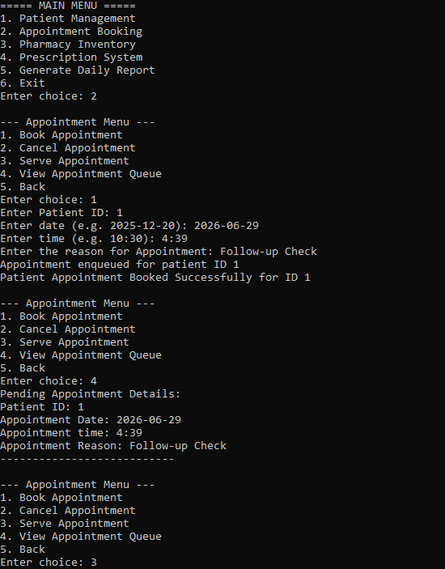
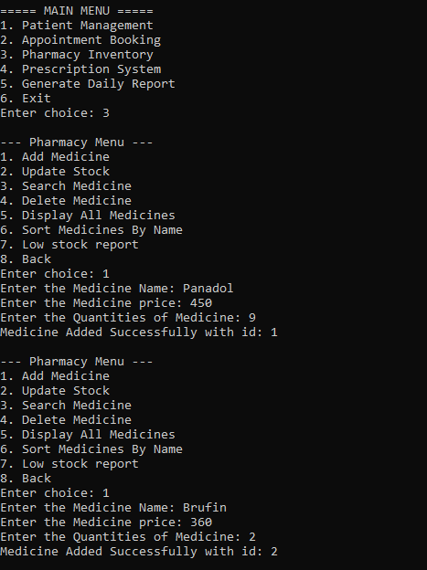
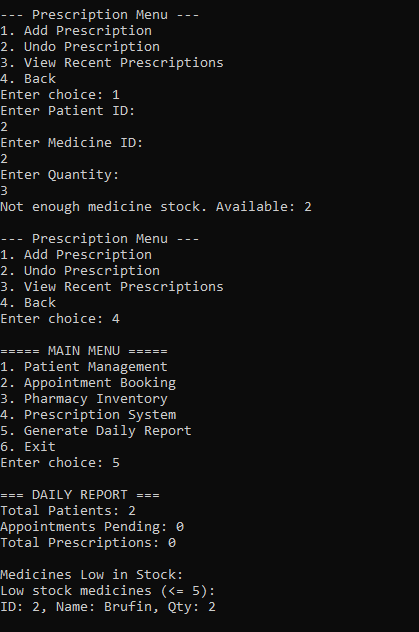

# Digital Clinic and Pharmacy Management System

## Description

This is a Digital Clinic and Pharmacy Management System developed in C++. The project helps manage patient records, appointments, medicines, prescriptions and daily reports through a simple console based interface. It uses different data structures to organize and manage the data efficiently.

---

## Features

- Add and manage patient records
- Book and manage appointments
- Manage pharmacy medicines
- Create patient prescriptions
- View daily reports
- Simple console based interface

---

## Technologies Used

- C++
- Object Oriented Programming (OOP)
- Data Structures
- Visual Studio

---

## Screenshots

### Patient Menu

### Appointment Menu

### Pharmacy Menu

### Prescription Menu and Daily Report

---

## Project Demo

Watch the project demo here:

[▶ Digital Clinic and Pharmacy Management System Demo](Demo/Digital-Clinic-Pharmacy-Management-System-Demo-Video.mp4)

---

## How to Run

1. Download or clone the repository.
2. Open the project in Visual Studio.
3. Build the project.
4. Run the project.
5. Follow the instructions shown in the console.

---

## Author

**Muhammad Talha**

Computer Science Student

---

## Thank You

Thank you for visiting this repository. I hope you find this project helpful.
